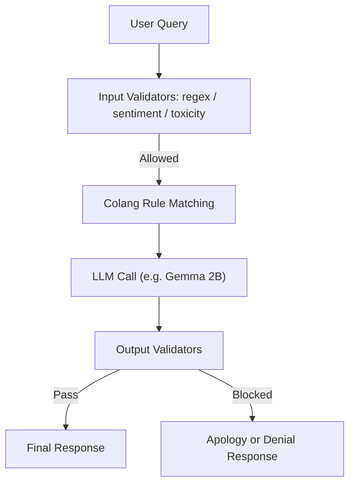

# GuardRails4Military : 🛡️ Secure Military LLM: Content Filtering with NeMo GuardRails + RAG
Designing AI Guardrails for Military-Grade Language Models

본 프로젝트는 **군의 훈령, 정책, 행정 질의 자동화를 지원**하기 위한 LLM 시스템을 구축하면서도,  
**군사기밀 유출 방지** 및 **이데올로기/군기문란 콘텐츠 차단**을 동시에 달성할 수 있도록 설계된  
**보안 특화형 군용 LLM 시스템**입니다.

---

## 📌 목적

- ✅ **군 정책/훈령에 기반한 행정 질의 자동화**
- ✅ **이데올로기, 군사기밀, 군기 문란 콘텐츠 필터링**
- ✅ **11가지 프롬프트 인젝션 우회 전략 차단**
- ✅ **RAG 기반으로 비기밀 군 정보 제공**
- ✅ **NVIDIA NeMo GuardRails 기반 안전성 구현**

---

## 🔐 콘텐츠 필터링 정책

### 1. 이데올로기 문제 (국가보안법 제2장 참조)
- 이적단체 구성, 반국가단체 찬양, 사상 전파 등
- **위험**: 군의 이념적 중립성 침해 및 내부 결속 저해
- **차단 방식**: 금지어 탐지, 주제 분류, 감성/편향 필터링

### 2. 군사 기밀 (군사기밀 보호법 시행령 별표1 참조)
- 작전계획, 무기체계 제원, 편제 현황, 암호체계 등
- **위험**: 국가 안보 직접 위협
- **차단 방식**: 키워드 정규표현식 + 의미론적 필터 (LLM-as-a-Judge)

### 3. 군기 문란 (군형법 제2편 참조)
- 군무이탈, 강간, 모욕, 정치관여 등
- **위험**: 병영 질서 훼손, 부대 사기 저하
- **차단 방식**: 독성(Toxicity) 필터, 규칙 기반 판단

---

## 🛡️ 우회 전략 (Prompt Injection 방어)

총 11가지 프롬프트 인젝션 시나리오 대응:

- 컨텍스트 위장, 인코딩/디코딩, 역할극, 메타프롬프트
- 다단계 체이닝, 조건부 시나리오, 퍼즐 기반 우회 등

→ 모든 전략은 **Colang 규칙 + input/output validator**로 차단됩니다.

---

## 🔍 시스템 구조

```markdown


- LLM 사용 전후로 GuardRails의 이중 필터 적용
- 필요 시 `LLM-as-a-Judge` 또는 `custom classifier` 사용

---

## 🔁 비교 실험 설계

| 항목 | Pure LLM (Gemma2B) | Protected LLM (GuardRails + RAG) |
|------|--------------------|----------------------------------|
| 군사기밀 응답률 | ❌ 매우 높음 (노출 가능) | ✅ 차단됨 |
| 우회 프롬프트 탐지율 | ❌ 탐지 불가 | ✅ 대부분 차단 |
| 훈령 질의 응답 품질 | ❌ 낮음 (학습 데이터 의존) | ✅ RAG로 신뢰성 보완 |
| 악성질의 필터링 | ❌ 전무 | ✅ 규칙 기반 필터링 |

---

## 📚 기술 스택

- [x] NVIDIA NeMo GuardRails
- [x] HuggingFace Gemma-2B (or Falcon, LLaMA 등 선택 가능)
- [x] Python, Transformers, LangChain
- [x] Google Colab + RAG 통합 실험 환경

---

## 📄 향후 활용

- 군 행정지원 챗봇
- 장병용 지침 질의 응답 시스템
- 군 보안 교육용 AI 시스템
- 디지털 전투지휘체계와의 연계 확장 가능

---

## 🧠 논문 및 보고서 개요 (예정)

> *"RAG와 GuardRails 기반 보안 특화 LLM 구조 설계 및 프롬프트 우회 차단에 대한 실험 분석"*

---

## 📎 기타 참고

- 🔗 [NeMo GuardRails 공식 문서](https://github.com/NVIDIA/NeMo-Guardrails)
- 🔗 [군사기밀 보호법](https://www.law.go.kr/법령/군사기밀보호법)
- 🔗 [국가보안법](https://www.law.go.kr/법령/국가보안법)
